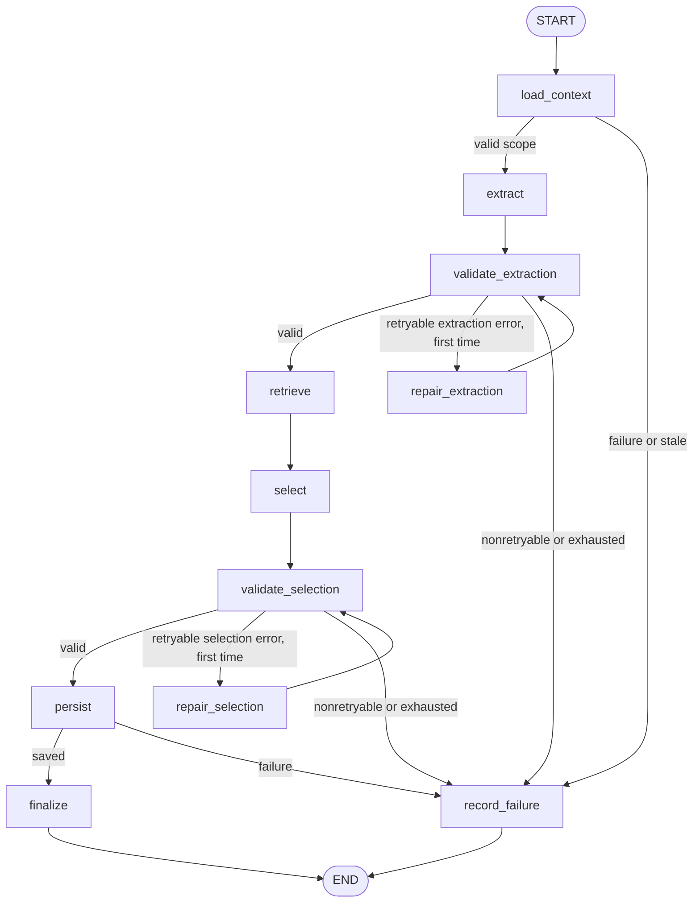

# W-35 — Build the bounded report-analysis graph

## Contract version

W-35; technical specification and bounded agent framework contract v1.3. Prerequisites: W-31 frozen LangGraph 1.2.12 / checkpoint-postgres 3.1.2; W-33 state and routing policy; W-34 typed tools.

## Changed files

- `backend/app/agent/nodes.py`
- `backend/app/agent/graph.py`
- `backend/tests/unit/agent/test_agent_graph.py`
- `docs/handoffs/W-35.md`

No shared tools, state, policy, database, worker, or framework dependency files changed.

## Behavior

Implemented a fixed synchronous LangGraph `StateGraph` with injected `AgentTools`, policy module and checkpoint saver. Nodes return partial state updates; routing functions are pure state-to-destination functions. Tool failures are reduced to stable codes and sanitized messages. Only retryable errors whose `stage` exactly equals `extraction` or `selection` enter that stage's single repair node. Repairs call the same tool method with the same fragment IDs or candidate set. Candidate retrieval is never repeated by selection repair. Empty candidate sets use the typed deterministic abstention path, which does not invoke the model.

The graph accounts for node/model/repair counters, validates per-stage and aggregate retry limits, and converts impossible routes or exhausted limits into terminal typed failure state. Stale schedule errors retain `stale`; lease/tool/internal errors become `failed`. Policy injection is used by both node budget checks and conditional routers.

## Exact node and edge manifest

Nodes, exactly:

```text
load_context, extract, validate_extraction, repair_extraction, retrieve,
select, validate_selection, repair_selection, persist, finalize, record_failure
```

Edges, including all conditional destinations:

```text
START -> load_context
load_context -> extract | record_failure
extract -> validate_extraction
validate_extraction -> retrieve | repair_extraction | record_failure
repair_extraction -> validate_extraction
retrieve -> select
select -> validate_selection
validate_selection -> persist | repair_selection | record_failure
repair_selection -> validate_selection
persist -> finalize | record_failure
finalize -> END
record_failure -> END
```



## Route matrix

| Source | State condition | Destination |
| --- | --- | --- |
| `load_context` | action is `extract` | `extract` |
| `load_context` | impossible action, stale or failure | `record_failure` |
| `validate_extraction` | clean extraction validation | `retrieve` |
| `validate_extraction` | retryable extraction-stage error and no prior extraction repair | `repair_extraction` |
| `validate_extraction` | nonretryable, wrong-stage, invalid route, or retry exhausted | `record_failure` |
| `validate_selection` | clean proposal validation | `persist` |
| `validate_selection` | retryable selection-stage error and no prior selection repair | `repair_selection` |
| `validate_selection` | nonretryable, wrong-stage, invalid route, or retry exhausted | `record_failure` |
| `persist` | persistence succeeds | `finalize` |
| `persist` | persistence fails or action is impossible | `record_failure` |

The repair budget is inferred from frozen fields: extraction repair count is `min(max(extraction_calls - 1, 0), 1)`; selection repairs are total corrective retries less extraction repairs. A second selection-only repair is therefore rejected even when extraction was never repaired.

## Node-to-tool map

| Node | Typed operation |
| --- | --- |
| `load_context` | `load_job_context(job_id)` |
| `extract` | `report_metadata` property then `extract_observations(fragment_ids, report_metadata)` |
| `validate_extraction` | Strict observation/evidence/date/count checks over state and trusted report metadata |
| `repair_extraction` | Same `extract_observations` call, exactly once on qualifying error |
| `retrieve` | `retrieve_candidates(key, observation, schedule_version_id)` for each observation |
| `select` | `select_candidate(key, observation, exact_candidate_set, fragment_ids)` for each observation |
| `validate_selection` | `validate_proposal_drafts(state)` |
| `repair_selection` | Same `select_candidate` calls against the unchanged candidates, exactly once on qualifying error |
| `persist` | `persist_review_proposals(state)` |
| `finalize` | State-only terminal update to `ready_for_review` |
| `record_failure` | State-only stable terminal failure/stale conversion |

## Verification

- `.venv/bin/pytest backend/tests/unit/agent/test_agent_graph.py -q` — **8 passed**.
- `.venv/bin/ruff check backend/app/agent/nodes.py backend/app/agent/graph.py backend/tests/unit/agent/test_agent_graph.py` — **All checks passed**.

Focused graph tests snapshot the exact nodes and edges; traverse the no-repair path, extraction repair, selection repair, deterministic empty-candidate abstention, empty extraction, exhausted extraction repair, stale context, impossible route, node limit, and selection-only repair exhaustion. A two-observation regression confirms a later selection error returns no partial `selection_drafts` map and that the resulting state remains valid. The injected policy proxy test protects policy argument use.

## Limitations and next task

`finalize` and `record_failure` only produce bounded graph-state terminal updates because W-35 has no typed run/job lifecycle tool and must not add one. W-36 owns graph runtime, leases, telemetry/checkpoint lifecycle, and corresponding persistence of terminal status. A checkpoint after extraction or retrieval is not independently ready for durable resume: W-34 keeps extracted observations and returned-candidate provenance in invocation-local tool memory. O-04/W-36 must add a validated, non-model control-plane rehydration path from accepted checkpoint state before durable resume; W-35 does not implement it and makes no restart-readiness claim. This task does not introduce automatic framework retries, approval/progress behavior, persistence internals, database integration or worker integration.

Next: W-36 runtime/checkpoint and lifecycle integration using this graph entry point.
